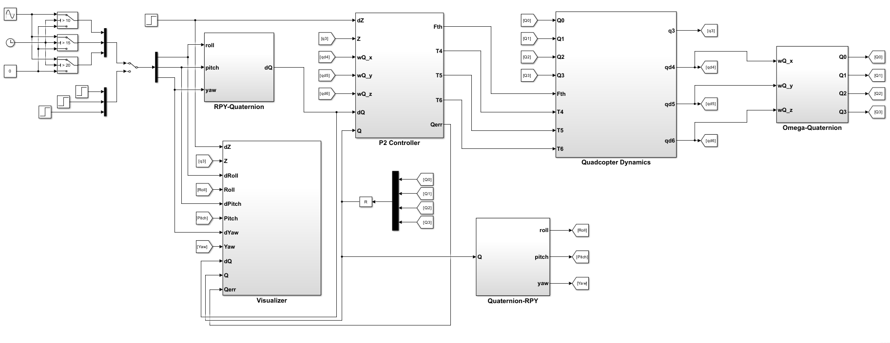
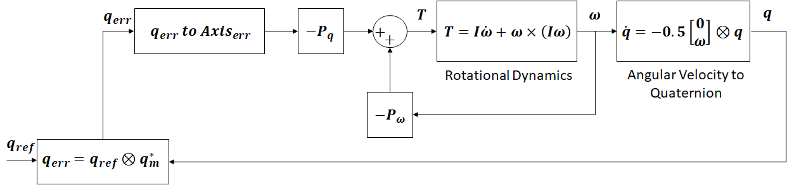
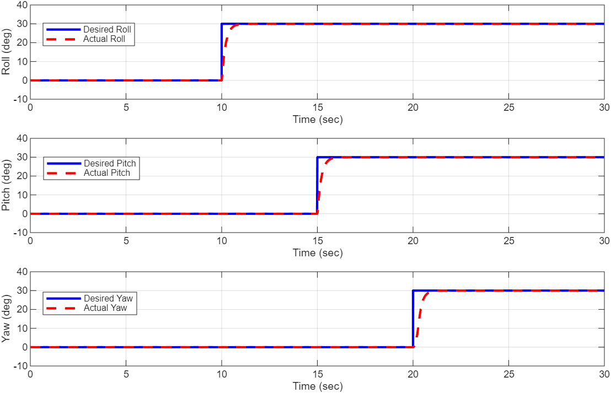
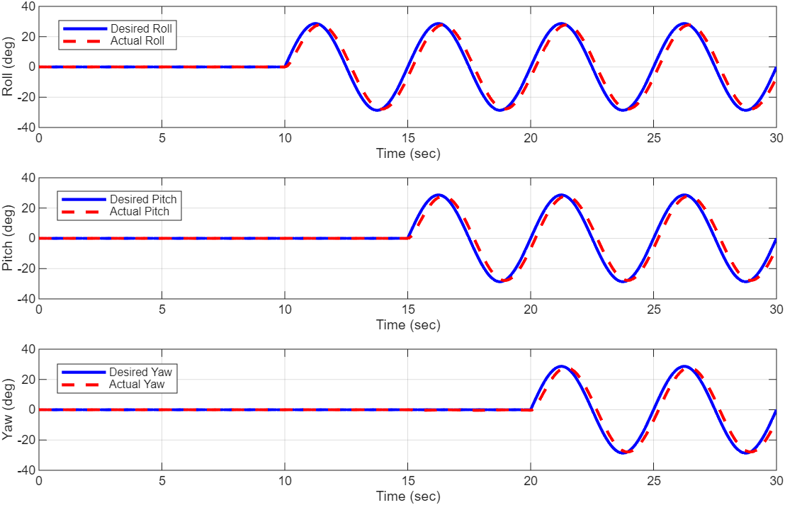

# Quaternion-Based Quadrotor Modeling and Control

This repository contains the implementation of a **quaternion-based attitude control system** for a quadrotor UAV, developed as part of my graduate seminar at the **Institute of Control Systems, RPTU Kaiserslautern-Landau**.  

Unlike Euler-angle–based methods, this approach fully exploits quaternion mathematics to overcome **gimbal lock** and reduce **computational overhead**, making it well-suited for real-time applications. The controller is implemented and tested in **MATLAB/Simulink**.

---

## Features
- **Quaternion-based modeling** of quadrotor translational and rotational dynamics using the Newton–Euler method.  
- **P2 nonlinear controller** for attitude stabilization and trajectory tracking.  
- **Singularity-free orientation representation** (no gimbal lock).  
- **Simulation in MATLAB/Simulink** with constraints on torque, thrust, and propeller speed.  
- Evaluation of:
  - **Step reference tracking** (roll, pitch, yaw).  
  - **Sinusoidal trajectory tracking** with real-world actuator limits.  

---

## Problem Statement
Quadrotors are nonlinear, underactuated systems with dynamics that are challenging to model and control.  
Traditional Euler-angle methods suffer from:
- **Singularities (gimbal lock)**  
- **Computational inefficiency** in real-time control  

This project explores **quaternion-based modeling and control** to overcome these issues.

---

## System Modeling
- **Translational dynamics** via Newton’s 2nd law.  
- **Rotational dynamics** via Euler’s rigid-body equations.  
- **Quaternion kinematics** with left-handed angular velocity convention.  
- **Coordinate transformations** (body ↔ inertial frame) using quaternion rotation.  

  

---

## Controller Design
- **Nonlinear P2 Controller** (proportional terms on quaternion error and angular velocity).  
- Gain tuning performed empirically for:
  - Fast settling time  
  - Minimal overshoot  
  - Respecting actuator constraints  

  

Typical settling times:  
- Roll ≈ **1.0 s**  
- Pitch ≈ **1.0 s**  
- Yaw ≈ **1.2 s**  

---

## Simulation Setup
- Implemented in **MATLAB/Simulink**.  
- Simulation step: **0.001 s**, duration: **30 s**.  
- Quadrotor parameters:  
  - Mass: **1.5 kg**  
  - Arm length: **0.16 m**  
  - Inertia: *Ix = 0.0123, Iy = 0.0125, Iz = 0.0210 kg·m²*  
  - Thrust coefficient: **21 × 10⁻⁶ N·s²**  

---

## Results

### Step Reference Tracking

  

- Fast convergence in roll, pitch, and yaw.  
- Negligible steady-state error.  

### Sinusoidal Trajectory Tracking

  

- Smooth response with slight phase lag due to damping.  
- Stable tracking under actuator constraints.  

---

---

## References
Key references used in this work:  
- Fresk & Nikolakopoulos, *Full Quaternion Based Attitude Control for a Quadrotor*, ECC 2013.  
- Lee, Leok & McClamroch, *Geometric Tracking Control of a Quadrotor UAV on SE(3)*, CDC 2010.  
- Mahony, Kumar & Corke, *Modeling, Estimation, and Control of Quadrotors*, IEEE R&A Magazine, 2012.  
- M. E. Elkomie, *Modeling and Control of a Quadrotor: Exploiting Quaternion Approach*, RPTU Kaiserslautern-Landau, 2025.  

---

## Author
**Mohamed Eid Mohamed Elkomie**  
📧 mohamed.elkomie@edu.rptu.de  
🔗 [LinkedIn](https://www.linkedin.com/in/mohamed-eid-70a6991a3)  
